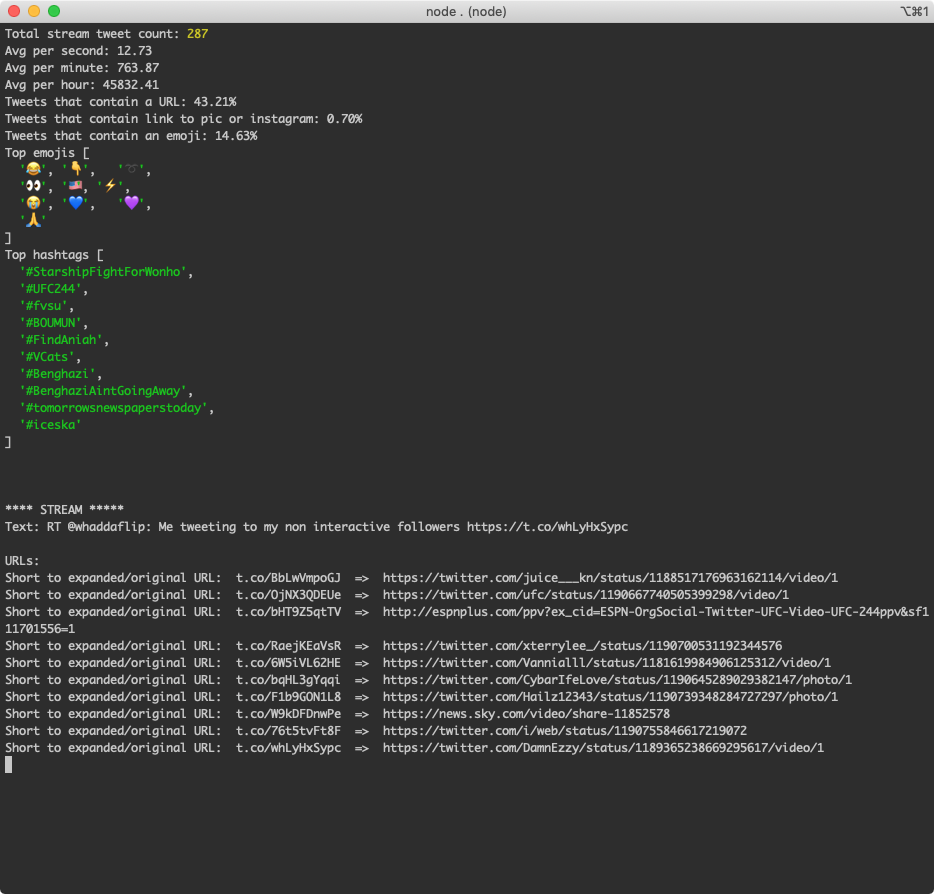

# twitter-stream

## Installation

ADD YOUR key, secret, token and token secret from https://developer.twitter.com/en/apps, then run:

```
npm i
npm start
```





## Notes

It uses shrinkwrap to avoid the `OutgoingMessage.prototype._headers is deprecated` warning.